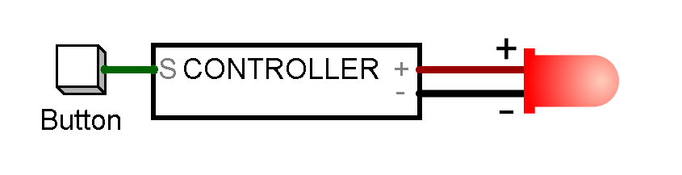
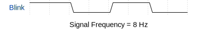
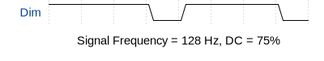
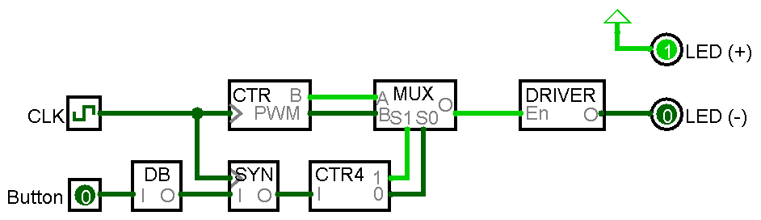
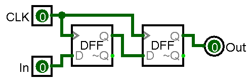
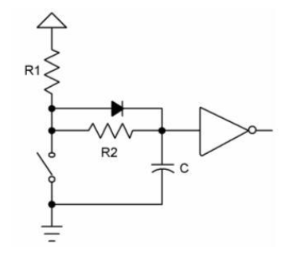
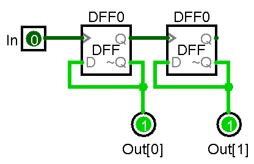
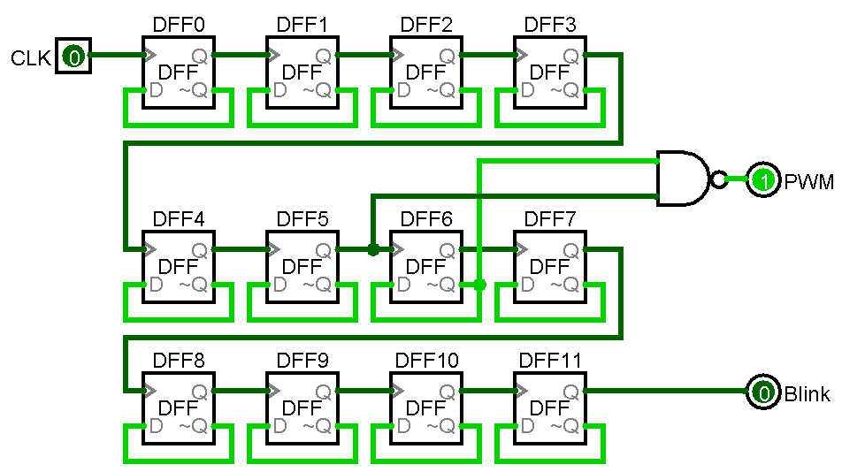
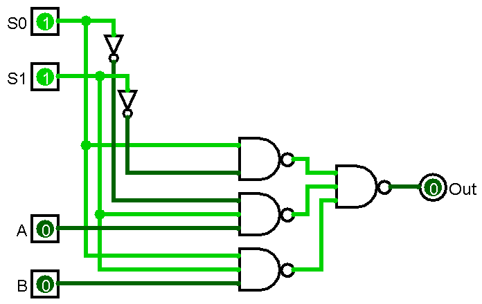
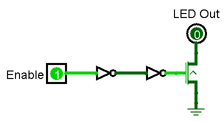

# Midterm: Bike Light LED Controller 
### Comparch F20 - Olin College
### Jasper Katzban
 

# Specification Document

A bike light is a simple device that uses some microelectronics to blink control an LED. In its most basic form, we can abstract the device to an button input, a controller, and an LED output, as shown:

Note that we assume the driving power for the LED and logic is supplied, but not shown.

By pressing the button, the user can cycle between modes of operation. Each mode is shown below:

For each of the following states, we can represent the signal driving the LED as a constant or periodical function with respect to time.

For `Off` and `On` states, the output is simply held constant.

When the LED is in `Blink` state, it cycles between `on` and `off` in a cyclic fashion, at a 50% duty cycle as shown. Since we're given a 32,768 Hz clock, we can divide by 4096 to get a blink rate of 8 times per second.

For the `Dim` stage, a PWM signal must be passed to the LED. The period of this cycle is orders of magnitude faster than that of the blink cycle as we rely on persistence of vision to give the illusion of dimming. We can use a 75% duty cycle signal as shown.

# Block Diagram

Given the spec, we can construct a high-level component overview incorporating all the elements necessary to make the LED behave as desired. Rather than pass the driving current for the LED through our logic, we use a transistor-based LED driver circuit connected to the cathode of the LED. When enabled, this circuit pulls the cathode to ground, completing the circuit and turning the LED on. When disabled, the terminal is floating and the LED remains off.

# Schematics

## Synchronizer (`SYN`)
In our digital circuits, we require that signals transition relative to the clock such that setup and hold times are met for flip-flops. Since the user can push the button at any time, there is no guarantee that this requirement will be met. To deal with this, we can use a synchronizer component.

We require that our digital signals transition in time with our clock signal so we can pass a clean, well timed signal to our flip flops. To aoccmplish this, we put two D flip-flops in parallel with a common clock to act as a timing buffer between the asychronous button press and the synchronous clock.

### Inputs
Clock (`CLK`)
Analog Button Input (`IN`)

### Outputs
Synchronized Button Signal (`Out`)

### Transistor Count
2x `DFF` = 2(26) = 52

### Schematic

## Debouncer (`DB`)

### Specification
Although we think of digital logic as a clean set of boolean signals, the real world is far from ideal. When a button is pressed, we get lots of noise and unsteady signal behavior which could confuse our circuit, so we need a way to 'digitize' the signal. This is done via a debouncer, effectively just an RC circuit to filter out small signal changes in voltage.

### Inputs
Synchronized Button Signal (`CLK`)

### Outputs
Debounced Digital Button Signal (`Out`)

### Transistor Count
We assume that the debouncer takes up an area equivalent to roughly 200 transistors.

### Schematic

## Button State Toggle (`CTR4`)

### Specification
We want to cycle through our four modes of operation by simply pressing a button, so we need a counter which goes from 0 to 4 and outputs corresponding select bits. We can construct this with two D flip-flops with with each of their `~Q` outputs tied to the select bit outputs as shown below.

### Inputs
Debounced Digital Button Signal (`In`)

### Outputs
Select bit 0 (`Out[0]`) \
Select bit 1 (`Out[1]`)

### Transistor Count
2x `DFF` = 2(26) = 52

### Schematic

## Combo Counter (`CTR`)

### Specification
To get our clock signal down to a usable frequency, we need to divide it many times. We accomplish this with D flip-flops chained such that the `Q` output of one connects to the following flip-flop's `CLK` input. We know that we need both a visible blinking signal and a faster PWM signal, so we can pull both off of the same frequency divider.

Since we're given a 32,768 Hz clock, we can divide by 4096 to get a rate of 8 times per second for `Blink` mode.

To accomplish dimming, we take an upstram pair of adjacent D flip-flops cycling at 128hz and NAND their outputs as shown to achieve a 75% duty cycle signal.

### Inputs
Clock (`CLK`)

### Outputs
PWM Output Signal (`PWM`)\
Blinking Signal (`Blink`)

### Transistor Count
`NAND2` + 12x `DFF` = 4 + 12(26) = 316

### Schematic

## Multiplexer (`MUX`)

### Specification
Now that we've generated our signals, it's time to select which one we want and pass it to the LED driver. We do this with a modified mux, which takes our two select bits (`S0` and `S1`) and produces the desired signal. Since the first to modes are `Off` and `On`, we can tie our fist select bit to the first two mux inputs, and put a `NAND2` with it and the negated value of the second select bit.

### Inputs
Select bit 0 (`S0`)\
Select bit 1 (`S1`)

### Outputs
LED Output (`Out`)

### Transistor Count
2x `NOT` + `NAND2` + 3x `NAND3` = 2(2) + 4 + 3(6) = 26

### Schematic

## LED Driver (`DRIVER`)

### Specification
To drive the LED, we need to get our logic-level signals to a point where they can control an LED. We do this with a series of inverters and a PNP transistor. When enabled, the transistor closes and allows the Cathode of the LED to bridge to ground, completing the circuit and turning on the LED.

### Inputs
LED Enable (`Enable`)

### Outputs
LED Cathode (`LED Out`)

### Transistor Count
We assume the LED driver takes up an area equivalent to 172 transistors.

### Schematic

# Cost Estimation

We compute the transistor area cost for the whole device, excluding the clock component which is assumed to be implemented outside of the device.

| Component | #Q |
|---:|---:|
| Debouncer | 200 |
| Synchronizer  | 52 |
| Combo Counter | 316 |
| Button State Toggle | 52 |
| Multiplexer | 26 |
| LED Driver | 172 |
| Total | 818 |

